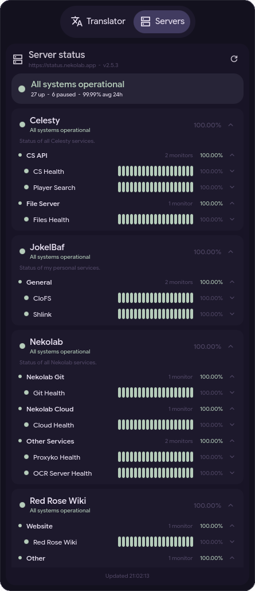

# kuma-status-cli

CLI for viewing your [Uptime Kuma](https://github.com/louislam/uptime-kuma) status pages from the terminal, or as JSON for scripts and desktop widgets.

```
  https://kuma.example.com  v2.5.3
  ● Partially Degraded Service   4 up   1 down   1 pending   98.49% avg 24h

  Homelab                                             Partially Degraded Service
  Everything running in the rack under my desk
  ------------------------------------------------------------------------------

  Core                                                                    99.74%
  ● API gateway      ████████████████████████████████████████   100.00%    24 ms
  ● PostgreSQL       ████████████████████████████████████████    99.21%     3 ms

  Media                                                                   95.10%
  ● Jellyfin         ████████████████████████████████████████    91.40%         -
    -> connect ECONNREFUSED 10.0.0.4:8096
```

## Uptime Kuma compatibility

The tool was primarily tested against Uptime Kuma **2.5.3**, but it should also work with 1.23.x. 

## Installation

With uv:
```bash
uv tool install git+https://github.com/JokelBaf/kuma-status-cli
```
Or pipx:
```bash
pipx install git+https://github.com/JokelBaf/kuma-status-cli
```

Alternatively, run it straight from a checkout:

```bash
uv run kuma-status-cli
```

## Usage

Use `configure` command for an interactive setup, or pass the URL and credentials on the command line:
```bash
kuma-status-cli configure
kuma-status-cli configure --url https://kuma.example.com --login admin --password secret

# Without verification:
kuma-status-cli configure --url https://kuma.example.com --login admin --password secret --no-verify
```

Then print the status of every status page:

```bash
kuma-status-cli                # styled terminal report
kuma-status-cli --json         # machine readable snapshot
kuma-status-cli --beats 20     # fewer heartbeats per monitor
```

## JSON output

Passing the `--json` argument emits status information in JSON format:

```jsonc
{
  "url": "https://kuma.example.com",
  "generated_at": "2026-09-05T19:24:00+00:00",
  "version": "1.23.13",
  "status": "degraded",              // operational | degraded | outage | maintenance | unknown
  "uptime_24h": 98.4857,
  "monitor_counts": { "up": 4, "down": 1, "pending": 1, "maintenance": 0, "paused": 1, "unknown": 0 },
  "pages": [
    {
      "id": 1,
      "slug": "homelab",
      "title": "Homelab",
      "description": "Everything running in the rack under my desk",
      "published": true,
      "status": "degraded",
      "uptime_24h": 97.882,
      "error": null,                 // set when a status page could not be loaded
      "groups": [
        {
          "id": 1,
          "name": "Core",
          "status": "operational",
          "uptime_24h": 99.7367,
          "monitors": [
            {
              "id": 1,
              "name": "API gateway",
              "type": "http",
              "url": null,           // only present when the status page publishes it
              "active": true,
              "status": "up",        // up | down | pending | maintenance | paused | unknown
              "message": "200 - OK",
              "ping": 24.0,
              "avg_ping": 26.4,
              "uptime_24h": 100.0,
              "uptime_30d": 99.98,
              "heartbeats": [
                { "status": "up", "time": "2026-09-05 19:20:00", "ping": 24.0, "message": "200 - OK", "important": false }
              ]
            }
          ]
        }
      ]
    }
  ]
}
```

Note that unpublished status pages cannot be fetched over Uptime Kuma's public endpoint. Such a page still appears in the output, with `error` explaining why its groups are empty.

## Hyprland sidebar widget

I built the tool for my Hyperland setup so I'm sharing the code for the sidebar widget in this repo. `widget/` contains the Quickshell (end-4 illogical-impulse) files that render this data as a left-sidebar tab.



Deploy the widgets with:
```bash
cp -r widget/modules ~/.config/quickshell/ii/
```

## Development

```bash
uv sync
uv run ruff check .
uv run ruff format .
uv run pyright
```

## License

The project is licensed under the Apache License 2.0, see [LICENSE](LICENSE) for details.
